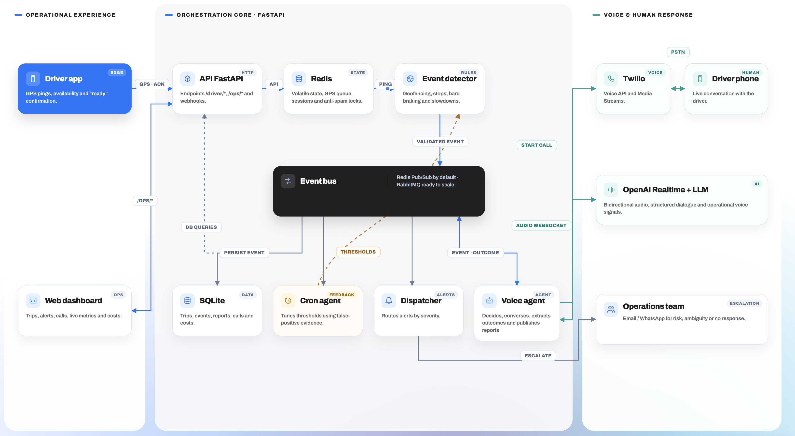

# Agent 21

**Autonomous voice operations for port logistics.**

Agent 21 was built for Challenge #4, **“The Agent on the Line,”** at the
Yuno × Nauta NextWave Hackathon.

## What Agent 21 solves

Port logistics teams still depend on operators continuously watching vehicle
positions, calling drivers, recording what happened, and escalating incidents
manually. This creates delays, repetitive work, and limited visibility when
several trips require attention at the same time.

Agent 21 turns GPS signals and operational events into coordinated actions:

1. The driver app sends the truck's location and speed.
2. The detector identifies arrivals, unexpected stops, sudden slowdowns, and
   route deviations.
3. The event bus routes each incident to the voice agent and alert dispatcher.
4. The agent calls the driver, gathers context, and produces a structured
   operational report.
5. The operations dashboard surfaces the trip timeline, calls, alerts,
   escalation status, and cost metrics.
6. A human operator remains responsible for cases that require intervention.

The result is an exception-based workflow: operators focus on the trips that
need judgment instead of repeatedly checking every trip.

### AI-native loop

```text
Operational signal → event detection → voice interaction → structured triage
                   → evidence and recommendation → human escalation when needed
```

Agent 21 combines deterministic operational rules with OpenAI-powered
conversation and triage. Risky or incomplete outcomes are escalated instead of
being silently resolved.

## Architecture


## Run locally

### Prerequisites

- Docker Desktop with Docker Compose
- Node.js and npm
- Python 3
- Expo Go on a physical phone if you want to run the driver app
- Internet access on the first run to download images and Node dependencies

The startup script is optimized for macOS when automatically discovering the
computer's LAN address for Expo. On another operating system, set
`EXPO_PUBLIC_API_URL` manually to an address the phone can reach.

### Quick start: safe simulated mode

No paid credentials are required for the default demo. Calls and notifications
are simulated unless explicitly enabled.

```bash
git clone https://github.com/sleepydogo/next-wave-jaimeros.git
cd next-wave-jaimeros
./start.sh
```

The script:

- starts Redis, RabbitMQ, and the FastAPI backend with Docker Compose;
- creates or reuses a demo trip;
- installs and starts the React operations dashboard;
- installs and starts the Expo driver app;
- prints the demo trip ID and the API URL used by the phone.

After startup, open:

| Service | URL or access |
| --- | --- |
| Operations dashboard | <http://localhost:5173> |
| Backend API | <http://localhost:8000> |
| Interactive API documentation | <http://localhost:8000/docs> |
| Browser voice test | <http://localhost:8000/dev/voz> |
| RabbitMQ console | <http://localhost:15672> — `nextwave` / `nextwave-dev` |
| Driver app | Scan the Expo QR code printed in the terminal |

The browser voice test requires `OPENAI_API_KEY`. The rest of the simulated
workflow can start without paid credentials; without an OpenAI key, the voice
brain uses its deterministic fallback.

### Demo walkthrough

Keep `./start.sh` running and use a second terminal.

Run the complete arrival flow:

```bash
docker compose exec backend python -m sim.simulate_trip llegada
```

This simulates a truck approaching the port, entering the geofence, receiving
an arrival call, and then receiving a second call when the port authorizes the
load.

Additional scenarios:

```bash
docker compose exec backend python -m sim.simulate_trip parada
docker compose exec backend python -m sim.simulate_trip frenada
```

- `parada` simulates an unexpected stop and creates a high-priority alert.
- `frenada` simulates a sudden slowdown and creates an operational alert.

While a scenario runs:

1. Open the dashboard at <http://localhost:5173>.
2. Follow the active transfer and its event timeline.
3. Open **Alerts** to inspect the generated incident.
4. Open the associated call to inspect its transcript, triage, and cost.
5. Check <http://localhost:8000/ops/metrics> for live operational metrics.

The driver app also includes a collapsed **Debug** section with manual demo
triggers for arrival, deviation, stop, and slowdown events.

### Reset or stop the demo

Reset the application data through the API:

```bash
curl -X POST http://localhost:8000/ops/reset
```

Start again with clean Docker volumes:

```bash
./start.sh --clean
```

Press `Ctrl+C` in the terminal running `start.sh` to stop the frontends and
Docker services. You can also stop the services directly with:

```bash
docker compose down
```

### Enable real phone calls

Real calls can spend Twilio and OpenAI credits. Keep the default simulated mode
for development and judging unless a real call is intentional.

```bash
cp .env.example .env
```

Complete the following values in `.env`:

```dotenv
SIMULATE_CALLS=0
TWILIO_ACCOUNT_SID=...
TWILIO_AUTH_TOKEN=...
TWILIO_FROM=...
DEMO_WORKER_PHONE=...
OPENAI_API_KEY=...
NGROK_AUTHTOKEN=...
NGROK_DOMAIN=your-domain.ngrok-free.app
PUBLIC_URL=https://your-domain.ngrok-free.app
```

Replace every `CHANGEME` placeholder before starting the mobile app or real
calls. Then run:

```bash
./start.sh --calls
```

Twilio uses these backend webhooks:

```text
POST /twilio/voice/{call_id}
POST /twilio/gather/{call_id}
POST /twilio/status/{call_id}
WS   /twilio/stream/{call_id}
```

## Project structure

```text
.
├── backend/
│   ├── app/
│   │   ├── agent/                 # Voice brain, caller, reports, and audio signals
│   │   ├── api/                   # Driver, operations, Twilio, and demo endpoints
│   │   ├── detector/              # GPS event rules and detector worker
│   │   ├── dispatcher/            # Alert persistence and notification delivery
│   │   ├── jobs/                  # Adaptive threshold agent
│   │   ├── bus.py                 # Redis or RabbitMQ event transport
│   │   ├── config.py              # Environment-based configuration
│   │   ├── costs.py               # Agent and human cost model
│   │   ├── db.py                  # SQLite schema and data access
│   │   ├── events.py              # Versioned event names and validation
│   │   ├── main.py                # FastAPI application and background workers
│   │   └── state.py               # Redis queues, windows, sessions, and locks
│   ├── agent/
│   │   ├── examples/              # Example event payloads
│   │   ├── event.schema.json      # Event contract schema
│   │   └── EVENTS.md              # Event contract documentation
│   ├── sim/
│   │   └── simulate_trip.py       # Repeatable demo scenarios
│   ├── Dockerfile
│   └── pyproject.toml
├── mobile/
│   ├── components/                # Driver map and trip detail components
│   ├── App.tsx                    # Expo driver experience
│   ├── api.ts                     # Driver API client
│   └── package.json
├── web/
│   ├── public/                    # Brand and browser assets
│   ├── src/
│   │   ├── components/            # Operations dashboard components
│   │   ├── api.ts                 # Operations API client
│   │   ├── App.tsx                # Dashboard routes and views
│   │   └── useDatos.tsx           # Live backend polling and shared state
│   └── package.json
├── docs/                          # Product and design documentation
├── .env.example                   # Backend and integration configuration template
├── docker-compose.yml             # Redis, RabbitMQ, backend, and optional ngrok
└── start.sh                       # Full local demo launcher
```

## Configuration

The project starts in a safe simulated mode. Add a root `.env` only when you
need to override defaults or connect external services.

| Variable | Purpose | Required by default |
| --- | --- | --- |
| `SIMULATE_CALLS` | Uses simulated calls when set to `1` | No; defaults to `1` |
| `SIMULATE_DISPATCH` | Simulates external alert delivery | No; defaults to `1` |
| `OPENAI_API_KEY` | Enables LLM conversation and OpenAI Realtime | No |
| `OPENAI_MODEL` | Selects the chat model | No |
| `VOICE_MODE` | Selects `gather` or `realtime` for Twilio calls | No |
| `TWILIO_ACCOUNT_SID` | Twilio account identifier | Real calls only |
| `TWILIO_AUTH_TOKEN` | Twilio authentication and webhook validation | Real calls only |
| `TWILIO_FROM` | Twilio caller number | Real calls only |
| `DEMO_WORKER_PHONE` | Driver number used by the seeded trip | Real calls only |
| `NGROK_AUTHTOKEN` | Starts the ngrok voice profile | Real calls only |
| `NGROK_DOMAIN` | Public hostname used by Twilio and the mobile app | Real calls only |
| `PUBLIC_URL` | Public backend URL used in Twilio callbacks | Real calls only |
| `RESEND_API_KEY` | Enables real email alert delivery | No |
| `ALERT_EMAIL_TO` | Recipient for operational email alerts | Email delivery only |
| `GOOGLE_MAPS_API_KEY` | Backend reverse geocoding | No |
| `VITE_API_URL` | Backend URL used by the web dashboard | No; local default provided |
| `VITE_GOOGLE_MAPS_API_KEY` | Google Maps key used by the web dashboard | Map only |
| `VITE_GOOGLE_MAPS_MAP_ID` | Google Maps style/map identifier | Map only |
| `EXPO_PUBLIC_API_URL` | Backend URL reachable from the driver phone | Set by `start.sh` locally |
| `EXPO_PUBLIC_GOOGLE_MAPS_API_KEY` | Google Maps key used by the driver app | Map only |

Cost assumptions can also be overridden with `P_VOICE_MIN`, `P_ASR_REQ`,
`P_LLM_IN`, `P_LLM_OUT`, `P_HUMAN_HOUR`, and `P_HUMAN_MIN_EVENT`.

## Current capabilities and demo scope

### Implemented

- Live operations dashboard with trips, alerts, call details, transcripts,
  audio playback, telemetry context, and cost metrics.
- Expo driver app with active-trip context, GPS updates, and repeatable demo
  event triggers.
- Detection of port arrival, unexpected stops, sudden slowdowns, and route
  deviations.
- Event-driven orchestration through RabbitMQ or Redis.
- Persistent trip, event, call, threshold, and alert records in SQLite.
- Simulated phone workflow for safe and repeatable demonstrations.
- Twilio call flow using speech gathering or bidirectional Realtime audio.
- OpenAI-powered conversation, structured triage, and operational reports.
- Browser-based Realtime voice test with acoustic voice-signal processing.
- Dashboard alerts with optional email delivery through Resend.
- Adaptive detector thresholds using an LLM when configured, with a
  deterministic heuristic fallback.
- Measured agent-call costs and configurable human-cost comparison.

### Intentional demo scaffolding

- The port authorization event is triggered manually instead of being connected
  to a specific port-management system.
- Calls, notifications, and external integrations are simulated by default to
  keep the demo safe, deterministic, and free of accidental charges.
- SQLite and a single FastAPI process keep local setup small for the hackathon;
  the event-driven modules can be separated for a production deployment.
- Google Maps, Twilio, OpenAI, ngrok, and Resend features require their own
  credentials when enabled.

## Cost model

Agent 21 compares the cost of an **operational event handled**—an arrival,
authorization, or incident—rather than only comparing call duration. This
reflects the time an operator would otherwise spend monitoring, calling,
retrying, and documenting the event.

The backend measures call duration, speech-recognition turns, and model token
usage. `GET /ops/metrics` exposes the accumulated agent cost, its human
equivalent, and estimated savings.

All price assumptions are configurable through environment variables. The
defaults are demo estimates and should be replaced with verified provider and
labor rates before using the model for a production decision.

## Tech stack

| Area | Technology |
| --- | --- |
| Operations dashboard | React, TypeScript, Vite, Tailwind CSS |
| Driver app | React Native, Expo, Expo Location, React Native Maps |
| Backend API | Python, FastAPI, Uvicorn |
| AI and voice | OpenAI Chat Completions, OpenAI Realtime, Twilio Voice |
| Event transport | RabbitMQ or Redis Pub/Sub |
| Operational state | Redis |
| Persistent data | SQLite |
| Maps and geocoding | Google Maps Platform |
| Email alerts | Resend |
| Local orchestration | Docker Compose |

## Team

Built by **Team 21agents** for the 2026 NextWave Hackathon, presented by Yuno
with Nauta.
